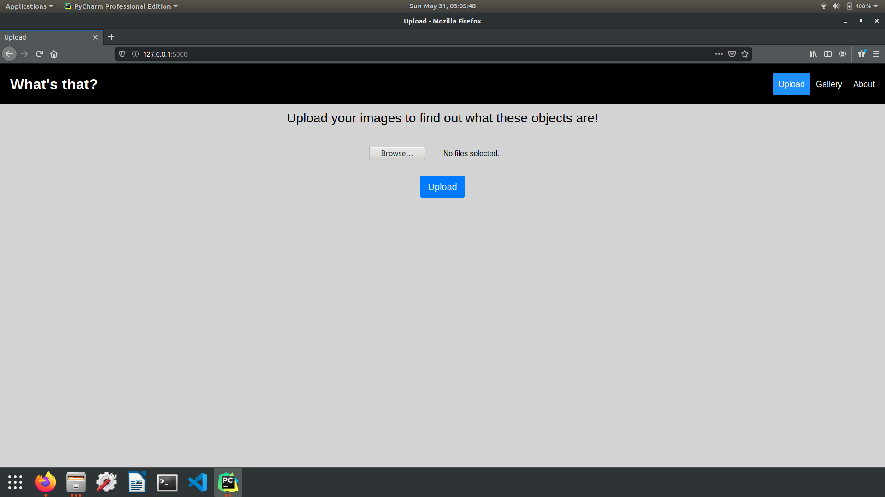
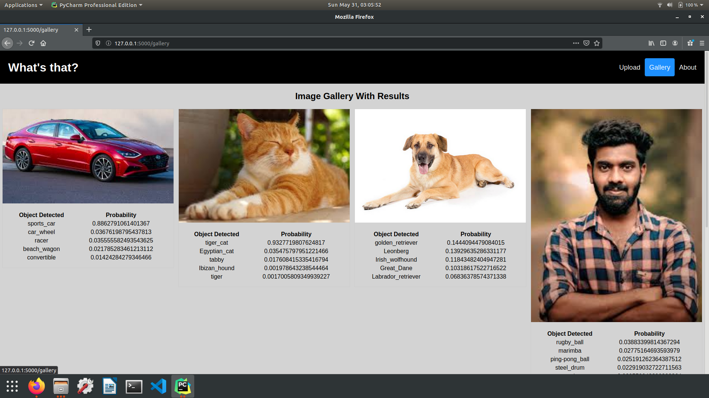

# WhatIsThat

Flask web application to detect objects in uploaded images.

\

## Features

* Uploaded images are detected using vgg16 model.
* Images are stored in an SQL database.
* All detected images are displayed in gallery.

## Screenshots

 

 
 

 

\
Pull requests are welcome. For major changes, please open an issue first to discuss what you would like to change.

